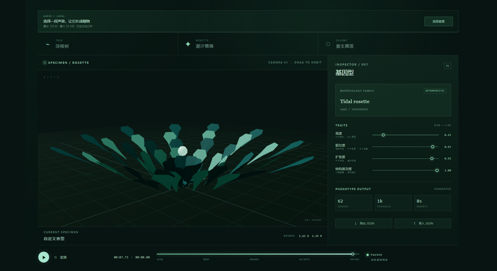
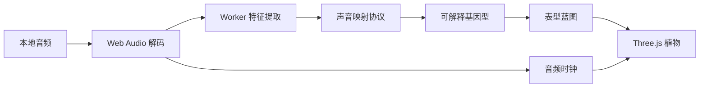
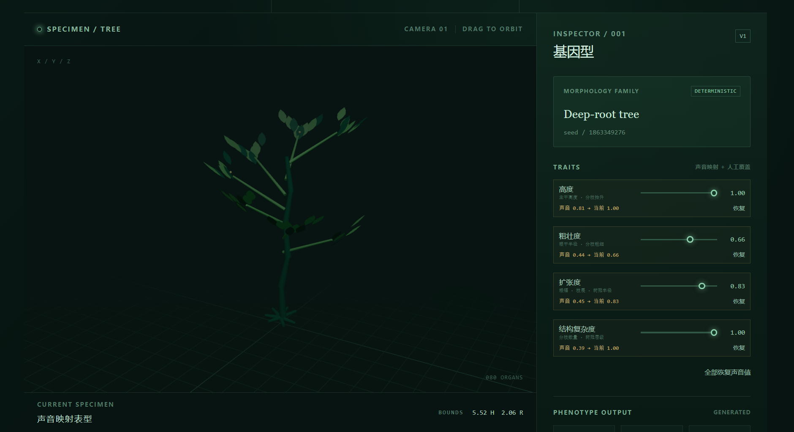
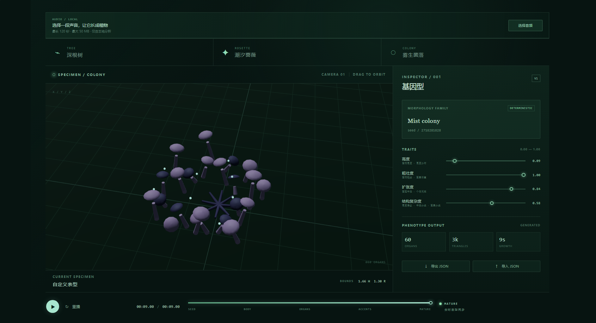

<div align="center">
  
  <h1>声音植物园</h1>
  <p><strong>声音驱动的 3D 表型实验台</strong></p>
  <p><em>A local-first 3D phenotype lab that turns sound into explainable, reproducible digital plants.</em></p>
  <p>
    
    
    
    
    
  </p>
</div>



## 项目简介

声音植物园把一段本地音频解析为具有可解释参数、确定性结构和连续生长过程的 3D 数字植物。它不是预渲染动画，而是一套从声音特征、基因型、表型蓝图到 Three.js 场景的完整生成链路。

音频仅在浏览器本地解码和分析，不上传服务器。相同音频与相同参数会生成可复现的植物，人工调整也会明确显示在声音映射值之上。



## 核心能力

- **本地音频分析**：浏览器内完成解码，支持最长 120 秒、最大 50 MB 的音频输入。
- **Worker 特征提取**：把分析计算移出主线程，提取能量、频谱、节奏与动态特征。
- **可解释映射**：声音特征映射为高度、粗壮度、扩张度和结构复杂度，界面同时显示声音值与人工覆盖值。
- **确定性连续生长**：统一 seed、蓝图与音频时钟，同一输入可以复现同一株植物及其生长过程。

## 三种形态族

<table>
  <tr>
    <td width="33.33%" align="center"><strong>深根树</strong><br /><sub>Deep-root tree</sub></td>
    <td width="33.33%" align="center"><strong>潮汐蔷薇</strong><br /><sub>Tidal rosette</sub></td>
    <td width="33.33%" align="center"><strong>雾生菌落</strong><br /><sub>Mist colony</sub></td>
  </tr>
  <tr>
    <td></td>
    <td></td>
    <td></td>
  </tr>
  <tr>
    <td>分枝层级、枝条方向和冠层轮廓</td>
    <td>叶片层级、径向展开和中心花序</td>
    <td>菌柄密度、个体尺度和群落分布</td>
  </tr>
</table>

## 可解释的表型参数

| 参数 | 控制内容 | 典型视觉结果 |
| --- | --- | --- |
| 高度 | 主干高度、分枝抬升、叶簇与菌柄高度 | 更高或更贴近地面的整体轮廓 |
| 粗壮度 | 根、茎、枝条、叶片或菌柄的尺度 | 更纤细或更厚重的器官比例 |
| 扩张度 | 横向跨度、枝展、叶冠半径、群落半径 | 更紧凑或更开放的空间占用 |
| 结构复杂度 | 分枝数量、器官层级、簇群密度 | 更简洁或更丰富的表型结构 |

参数范围统一为 `0.00` 到 `1.00`。声音映射提供初始值，人工覆盖保留可追踪的来源和恢复入口。

## 快速开始

需要 Node.js 20.19+ 或 22.12+，以及 pnpm。

```bash
pnpm install
pnpm dev
```

浏览器打开终端输出的本地地址，选择一段音频，随后可以切换形态、播放生长过程并调整表型参数。

## 常用命令

| 命令 | 用途 |
| --- | --- |
| `pnpm dev` | 启动 Vite 开发服务器 |
| `pnpm check` | 依次执行 lint、类型检查、单元测试和生产构建 |
| `pnpm test:e2e` | 执行 Playwright 端到端测试 |
| `pnpm build` | 生成生产版本到 `dist` |
| `pnpm preview` | 本地预览生产构建 |

## 技术栈

- React 19、TypeScript 6、Vite 8
- Three.js、React Three Fiber、Drei
- Web Audio API、Web Worker
- Zod、Vitest、Testing Library、Playwright

## 项目结构

```text
src/
├─ core/
│  ├─ audio/          # 音频解码、特征与映射协议
│  ├─ genotype/       # 基因型参数、预设与序列化
│  ├─ growth/         # 连续生长时间轴与器官动画
│  └─ phenotype/      # 表型蓝图、验证与形态生成器
├─ features/
│  ├─ audio/          # 音频输入与 Worker 协作
│  ├─ phenotype/      # Three.js 几何体与实例化渲染
│  └─ sandbox/        # 实验台状态与播放交互
├─ App.tsx            # 主界面与核心交互入口
└─ App.css            # 实验台视觉系统
tests/e2e/            # 浏览器交互与性能测试
```

## 当前边界

- 首屏 JavaScript 约 1.19 MB，后续可以按需动态加载 3D 模块。
- Android 与 iOS 真机帧率、触控体验和 WebGL 内存尚未验证。
- 当前定位是本地实验台，暂不包含云端存储、账号系统或在线协作。

## License

本项目使用 [MIT License](LICENSE)。
